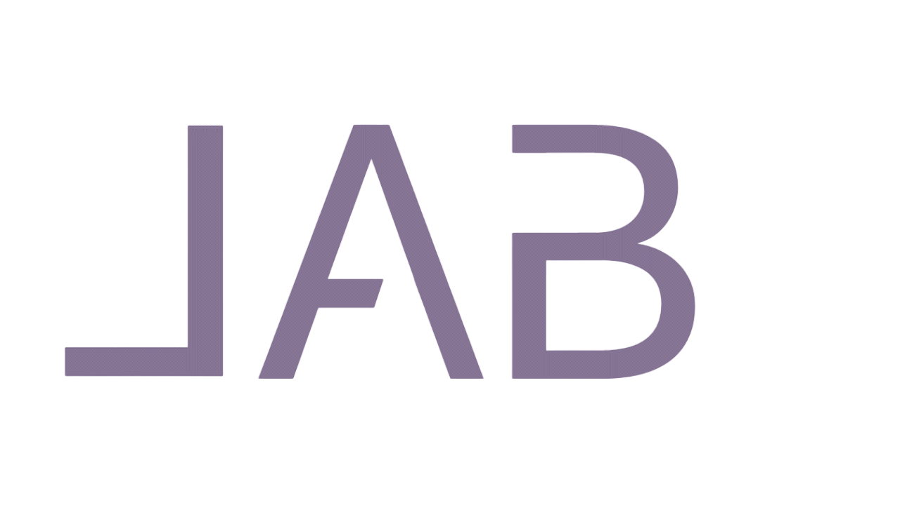

Ce repository contient le code source de mon site web personnel. Vous y trouverez mes réalisations et mon parcours.

**Installation**
1. Cloner le repository:
git clone https://github.com/Noalune12/portfolio.git

2. Installer toutes les dépendances pour le front-end:
npm install ou yarn

3. Lancer le front-end:
npm start ou yarn start
Le front-end sera lancé à l'URL: http://localhost:3000/.

**Technologies utilisées**
* React
* Sass
